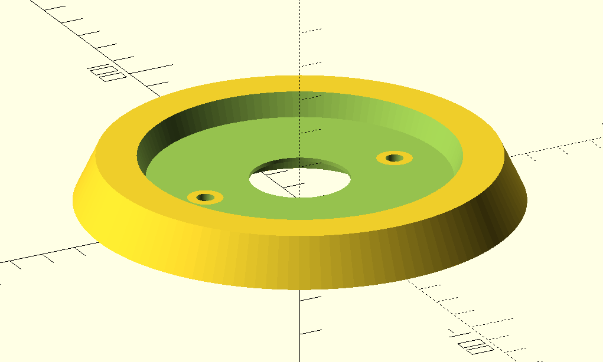
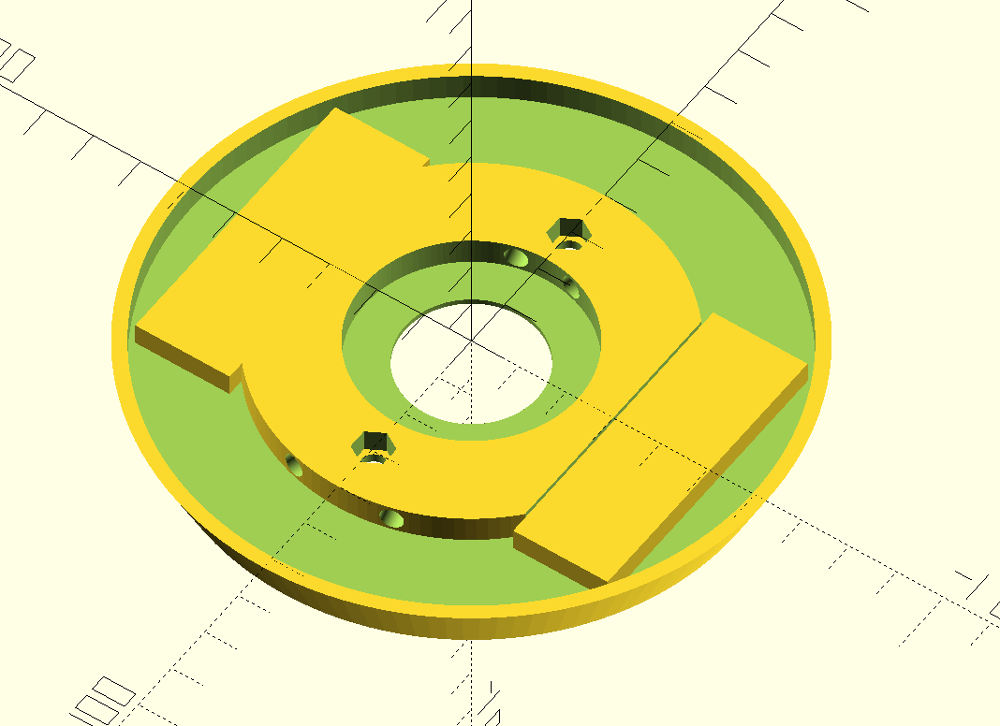
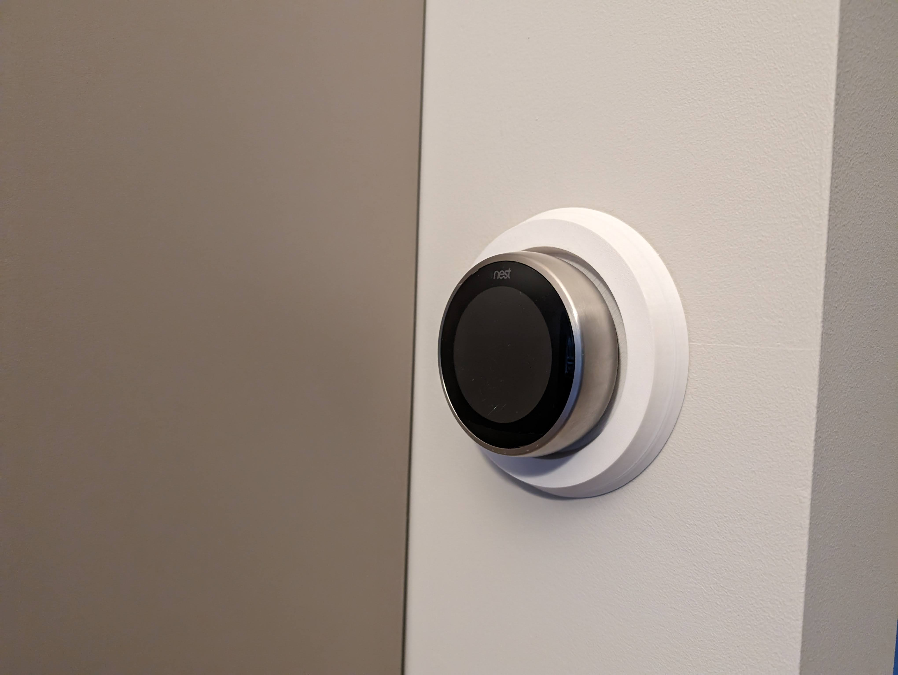
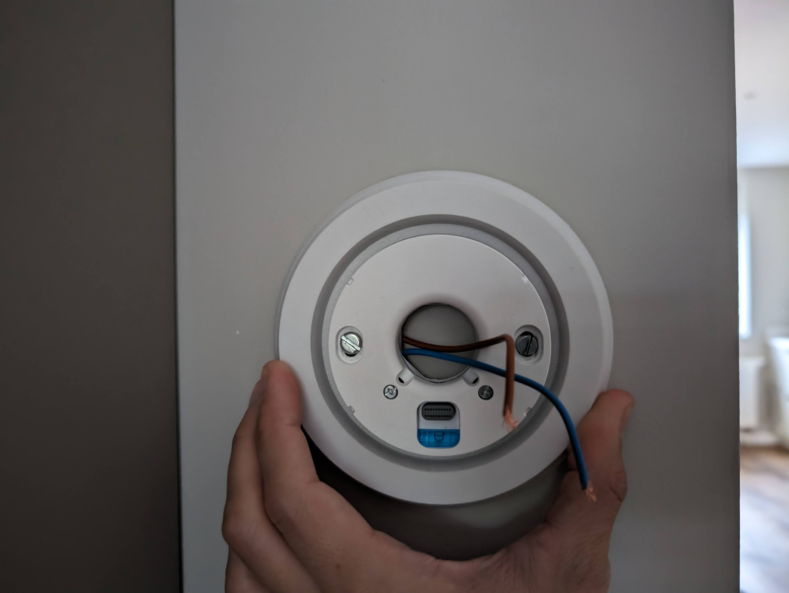
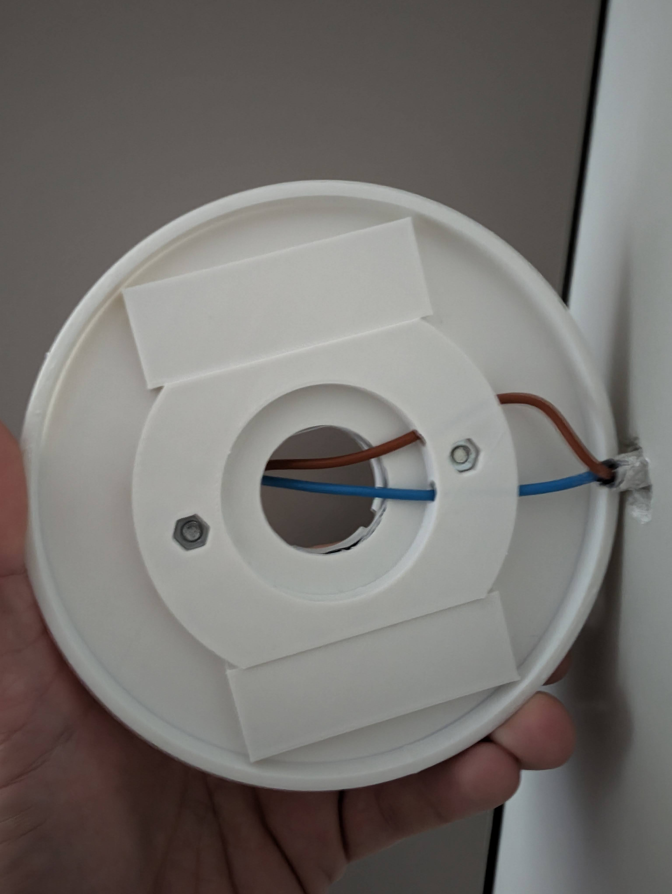

# nest-coverplate
## About
I created this cover plate with the aim of positioning my thermostat in the center of the wall, even if the wiring isn't perfectly centered. Since there's a power wire situated behind the thermostat, I required a solution that didn't involve drilling into the wall.

For this design, I've employed double-sided adhesive tape to secure it to the wall, along with screws and bolts to fasten the thermostat to the plate that holds the wires.

The design is coded with OpenSCAD.

## Renders

## Pictures

